# Meowchain Architecture

> Comprehensive architecture documentation for the Meowchain POA blockchain built on Reth.
> 35 Rust source files | 8,004 lines | 224 tests | Chain ID 9323310

---

## Table of Contents

1. [System Overview](#1-system-overview)
2. [Module Dependency Graph](#2-module-dependency-graph)
3. [Directory Structure](#3-directory-structure)
4. [Node Boot Sequence](#4-node-boot-sequence)
5. [PoaNode & Component Wiring](#5-poanode--component-wiring)
6. [Consensus Engine](#6-consensus-engine)
7. [Block Production Pipeline](#7-block-production-pipeline)
8. [Chain Specification](#8-chain-specification)
9. [Signing & Key Management](#9-signing--key-management)
10. [Genesis System](#10-genesis-system)
11. [On-Chain Governance Readers](#11-on-chain-governance-readers)
12. [Engine API Integration](#12-engine-api-integration)
13. [RPC Interface](#13-rpc-interface)
14. [Shared State & Concurrency](#14-shared-state--concurrency)
15. [Console Output](#15-console-output)
16. [Error Handling](#16-error-handling)
17. [Configuration Reference](#17-configuration-reference)
18. [Extra Data Format](#18-extra-data-format)
19. [Testing Architecture](#19-testing-architecture)

---

## 1. System Overview

Meowchain is a **Proof of Authority (POA)** blockchain that replaces Ethereum's Beacon Chain consensus with a signer-based model while preserving full EVM compatibility. It is built as a custom node on [Reth](https://github.com/paradigmxyz/reth), Rust's high-performance Ethereum client.

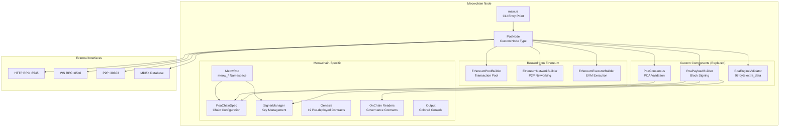

### What Makes Meowchain Different from Ethereum

| Aspect | Ethereum Mainnet | Meowchain |
|--------|-----------------|-----------|
| Consensus | Beacon Chain (PoS) | PoaConsensus (PoA) |
| Block Production | Validators + MEV | Round-robin signers |
| Block Signing | BLS signatures | ECDSA in extra_data |
| Difficulty | Dynamic | Always 0 (Engine API compat) |
| Governance | EIPs + social consensus | On-chain contracts + Gnosis Safe |
| Gas Limit | ~30M (protocol) | Governable (30M-1B via ChainConfig) |
| EVM | Sequential | Sequential (parallel planned) |
| Hardforks | Frontier through Prague | All active at genesis (block 0) |

---

## 2. Module Dependency Graph

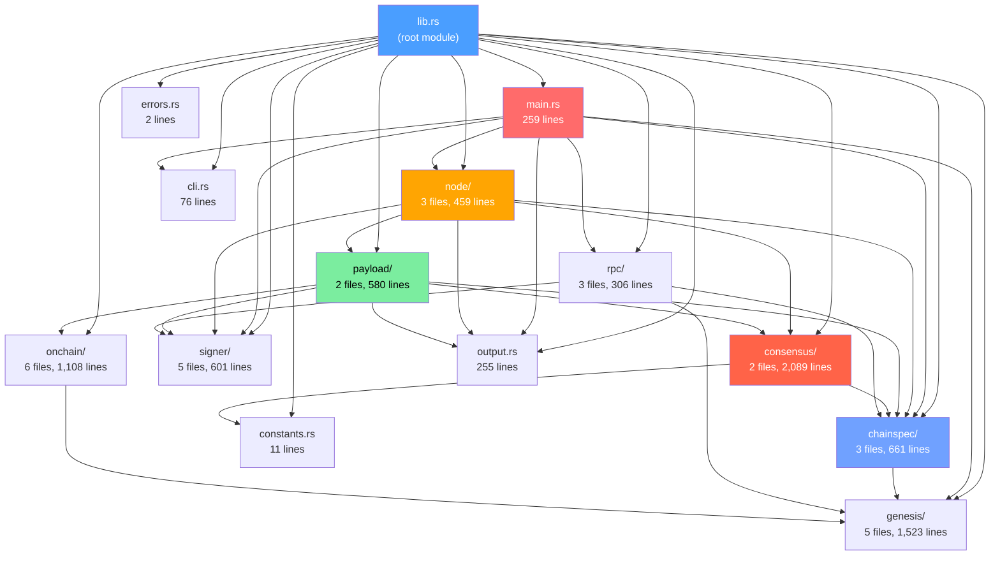

---

## 3. Directory Structure

```
src/
├── lib.rs                    (18 lines)    Root module declarations
├── main.rs                   (259 lines)   Entry point, CLI, node launch, block monitoring
├── cli.rs                    (76 lines)    CLI argument definitions (clap)
├── constants.rs              (11 lines)    Shared constants (EXTRA_VANITY, EXTRA_SEAL, etc.)
├── errors.rs                 (2 lines)     Re-exports PoaConsensusError + SignerError
├── output.rs                 (255 lines)   Colored console output (20 functions)
│
├── node/                                   Node type & component wiring
│   ├── mod.rs                (255 lines)   PoaNode, NodeTypes, Node impl, DebugNode
│   ├── builder.rs            (56 lines)    PoaConsensusBuilder (ConsensusBuilder trait)
│   └── engine.rs             (148 lines)   PoaEngineValidator (97-byte extra_data bypass)
│
├── consensus/                              POA consensus validation
│   ├── mod.rs                (2,022 lines) PoaConsensus, HeaderValidator, Consensus, FullConsensus
│   └── errors.rs             (67 lines)    PoaConsensusError (8 variants)
│
├── payload/                                Block production & signing
│   ├── mod.rs                (449 lines)   PoaPayloadBuilder, PayloadBuilder trait, sign_payload
│   └── builder.rs            (131 lines)   PoaPayloadBuilderBuilder (component-level builder)
│
├── chainspec/                              Chain specification
│   ├── mod.rs                (602 lines)   PoaChainSpec, live_signers, trait impls
│   ├── config.rs             (24 lines)    PoaConfig struct
│   └── hardforks.rs          (36 lines)    mainnet_compatible_hardforks()
│
├── signer/                                 Key management & block sealing
│   ├── mod.rs                (363 lines)   Integration tests for signing
│   ├── manager.rs            (77 lines)    SignerManager (RwLock<HashMap>)
│   ├── sealer.rs             (103 lines)   BlockSealer (seal_header, verify_signature)
│   ├── errors.rs             (18 lines)    SignerError (3 variants)
│   └── dev.rs                (40 lines)    Dev keys & setup_dev_signers()
│
├── genesis/                                Genesis configuration & contracts
│   ├── mod.rs                (898 lines)   GenesisConfig, create_genesis, tests
│   ├── accounts.rs           (38 lines)    dev_accounts(), dev_signers(), balances
│   ├── addresses.rs          (46 lines)    Contract address constants
│   ├── contracts.rs          (276 lines)   System/infra/Safe contract alloc
│   └── governance.rs         (266 lines)   ChainConfig/SignerRegistry/Treasury alloc
│
├── onchain/                                On-chain governance readers
│   ├── mod.rs                (831 lines)   StorageReader trait, tests
│   ├── providers.rs          (54 lines)    StateProviderStorageReader, GenesisStorageReader
│   ├── readers.rs            (144 lines)   read_gas_limit, read_signer_list, etc.
│   ├── slots.rs              (55 lines)    Storage slot constants
│   ├── selectors.rs          (24 lines)    ABI function selectors
│   └── helpers.rs            (54 lines)    encode/decode helpers
│
└── rpc/                                    Custom RPC namespace
    ├── mod.rs                (257 lines)   MeowRpc impl + tests
    ├── api.rs                (20 lines)    MeowApi trait (jsonrpsee macro)
    └── types.rs              (29 lines)    ChainConfigResponse, NodeInfoResponse
```

**Total: 35 files, 8,004 lines, 224 tests**

---

## 4. Node Boot Sequence

The entire startup flow is driven by `main.rs` (259 lines). Here is the exact sequence:

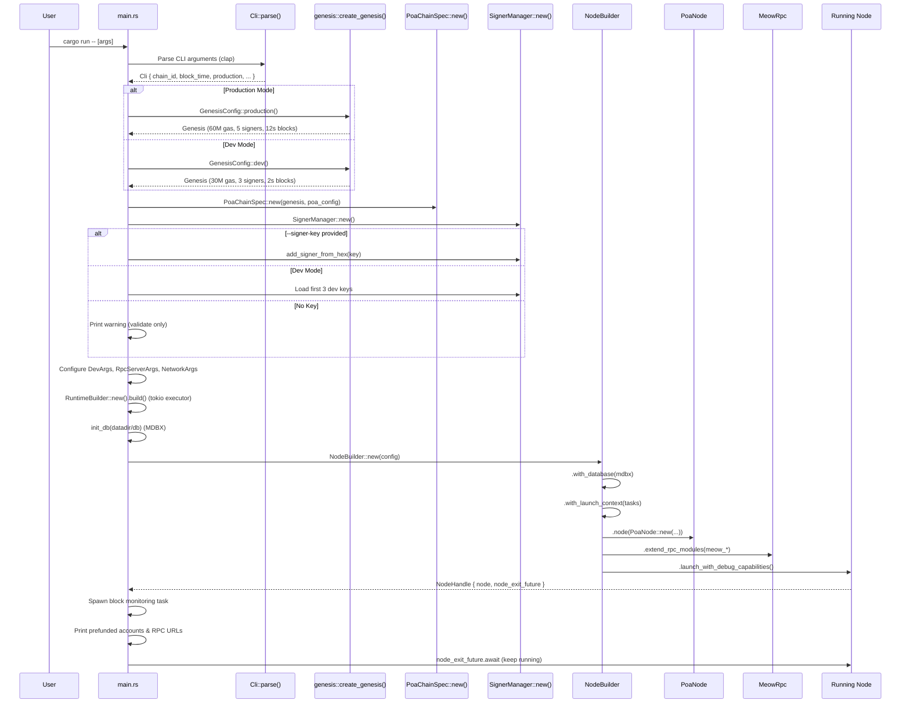

### CLI Arguments

| Argument | Type | Default | Description |
|----------|------|---------|-------------|
| `--chain-id` | `u64` | `9323310` | Network chain ID |
| `--block-time` | `u64` | `2` | Block interval in seconds |
| `--datadir` | `PathBuf` | `data` | Chain data directory |
| `--http-addr` | `String` | `0.0.0.0` | HTTP RPC listen address |
| `--http-port` | `u16` | `8545` | HTTP RPC port |
| `--ws-addr` | `String` | `0.0.0.0` | WebSocket listen address |
| `--ws-port` | `u16` | `8546` | WebSocket port |
| `--signer-key` | `Option<String>` | env `SIGNER_KEY` | Private key (hex) |
| `--production` | `bool` | `false` | Use production genesis |
| `--no-dev` | `bool` | `false` | Disable dev mode |
| `--gas-limit` | `Option<u64>` | - | Override gas limit |
| `--eager-mining` | `bool` | `false` | Mine on tx arrival |
| `--mining` | `bool` | `false` | Force mining in production |
| `--port` | `u16` | `30303` | P2P listener port |
| `--bootnodes` | `Option<Vec>` | - | Bootnode enode URLs |
| `--disable-discovery` | `bool` | `false` | Disable P2P discovery |

---

## 5. PoaNode & Component Wiring

`PoaNode` (`src/node/mod.rs:58-88`) is the core type that replaces `EthereumNode`. It implements Reth's `Node` trait and provides a `ComponentsBuilder` that wires custom components into the node pipeline.

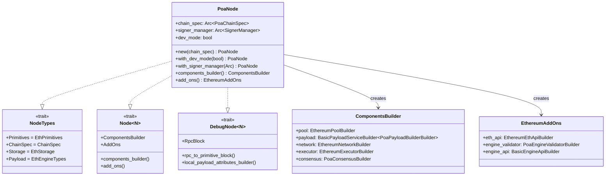

### What's Replaced vs Reused

| Component | Ethereum Default | Meowchain Override | Why |
|-----------|-----------------|-------------------|-----|
| Consensus | `EthBeaconConsensus` | `PoaConsensus` | POA signature validation instead of beacon |
| Payload Builder | `EthereumPayloadBuilder` | `PoaPayloadBuilder` (wraps inner) | Adds POA signing to built blocks |
| Engine Validator | `EthereumEngineValidator` | `PoaEngineValidator` | Bypasses 32-byte extra_data limit |
| Transaction Pool | `EthereumPoolBuilder` | *(reused)* | Standard Ethereum tx pool |
| EVM Executor | `EthereumExecutorBuilder` | *(reused)* | Identical EVM execution |
| Network | `EthereumNetworkBuilder` | *(reused)* | Standard devp2p |
| Eth RPC | `EthereumEthApiBuilder` | *(reused)* + `MeowRpc` addon | Standard eth_* + meow_* |

---

## 6. Consensus Engine

The consensus engine (`src/consensus/`) validates every block that enters the node. It implements three Reth traits at increasing levels of strictness.

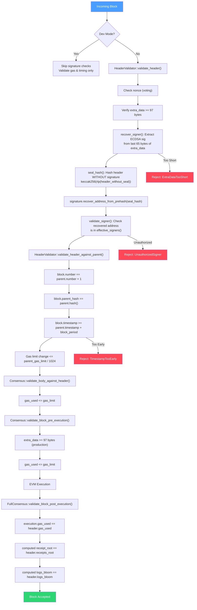

### Signature Recovery Flow (Detail)

```
extra_data (97 bytes for non-epoch blocks):
┌──────────────────────┬───────────────────────────────────┐
│   Vanity (32 bytes)  │      ECDSA Signature (65 bytes)   │
│  [0x00...00]         │  [r (32) | s (32) | v (1)]        │
└──────────────────────┴───────────────────────────────────┘
                             ↑
                        extract this
                             │
                             ▼
                   Signature::try_from(bytes)
                             │
           ┌─────────────────┴─────────────────────┐
           │  seal_hash = keccak256(              │
           │    rlp_encode(header_without_seal)   │
           │  )                                   │
           └─────────────────┬─────────────────────┘
                             │
                             ▼
              signature.recover_address_from_prehash(seal_hash)
                             │
                             ▼
                     recovered_address
                             │
                             ▼
              effective_signers().contains(recovered_address)?
```

### Fork Choice Rule

Since difficulty is always 0 (Engine API compatibility), Meowchain uses an **in-turn scoring** system for fork choice:

```rust
// Block N's in-turn signer = signers[N % signers.len()]
fn is_in_turn(header) -> bool {
    expected = chain_spec.expected_signer(header.number)
    actual = recover_signer(header)
    actual == expected
}

fn score_chain(headers) -> u64 {
    headers.filter(|h| is_in_turn(h)).count()
}

fn compare_chains(chain_a, chain_b) -> Ordering {
    score_a.cmp(score_b)          // More in-turn blocks wins
        .then(len_a.cmp(len_b))   // Tie-break: longer chain
}
```

---

## 7. Block Production Pipeline

The payload builder (`src/payload/`) wraps Reth's `EthereumPayloadBuilder` and adds POA signing as a post-processing step.

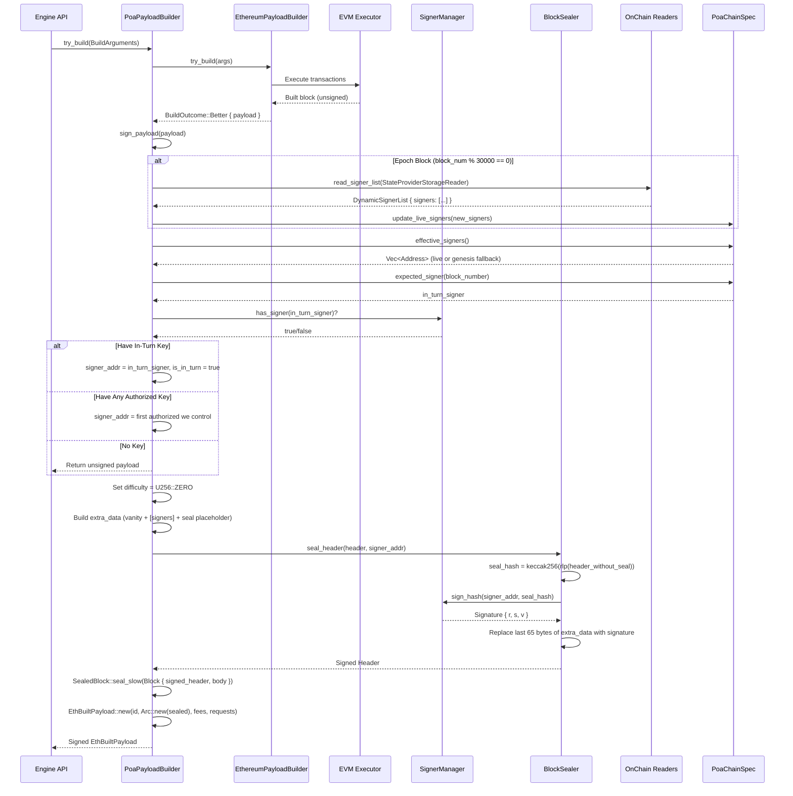

### Two Levels of Builder

| Level | Struct | Trait | Purpose |
|-------|--------|-------|---------|
| Component | `PoaPayloadBuilderBuilder` | `PayloadBuilderBuilder` | Creates `PoaPayloadBuilder` from `BuilderContext`. Reads on-chain gas limit at startup, seeds signer cache. |
| Build | `PoaPayloadBuilder` | `PayloadBuilder` | Called per-block. Delegates to `EthereumPayloadBuilder`, then signs. |

---

## 8. Chain Specification

`PoaChainSpec` (`src/chainspec/mod.rs`) wraps Reth's `ChainSpec` and adds POA-specific configuration plus a live signer cache.

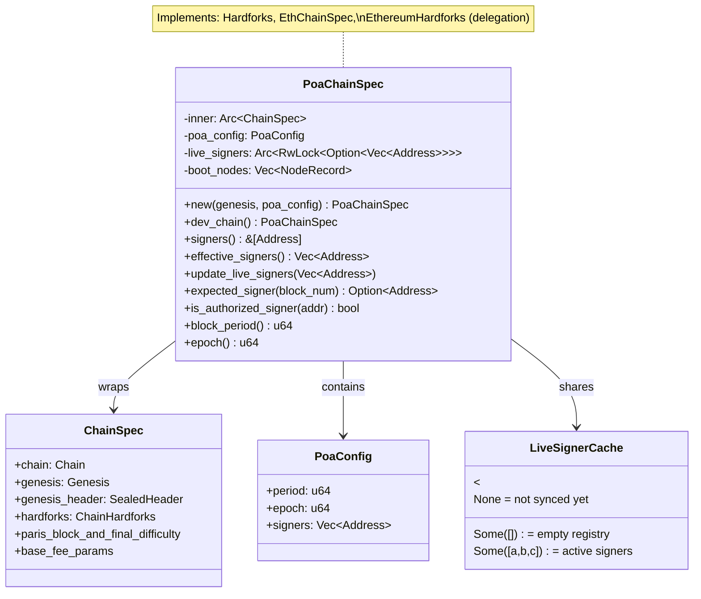

### `effective_signers()` Logic

```rust
pub fn effective_signers(&self) -> Vec<Address> {
    self.live_signers                    // Arc<RwLock<Option<Vec<Address>>>>
        .read().ok()                     // Acquire read lock
        .and_then(|g| g.clone())         // Clone the Option<Vec>
        .unwrap_or_else(||               // If None (not synced yet):
            self.poa_config.signers.clone()  // Fall back to genesis config
        )
}
```

### Round-Robin Signer Assignment

```
Block 0 → signers[0 % N]  (signer 0)
Block 1 → signers[1 % N]  (signer 1)
Block 2 → signers[2 % N]  (signer 2)
Block 3 → signers[3 % N]  (signer 0)  ← wraps around
...
Block N → signers[N % N]  (signer 0)
```

### Hardfork Configuration

All 14 Ethereum hardforks are active from genesis (block 0 / timestamp 0):

| Hardfork | Activation | Type |
|----------|-----------|------|
| Frontier | Block 0 | Block-based |
| Homestead | Block 0 | Block-based |
| Tangerine Whistle | Block 0 | Block-based |
| Spurious Dragon | Block 0 | Block-based |
| Byzantium | Block 0 | Block-based |
| Constantinople | Block 0 | Block-based |
| Petersburg | Block 0 | Block-based |
| Istanbul | Block 0 | Block-based |
| Berlin | Block 0 | Block-based |
| London | Block 0 | Block-based |
| Paris (The Merge) | TTD = 0 | TTD-based |
| Shanghai | Timestamp 0 | Timestamp-based |
| Cancun | Timestamp 0 | Timestamp-based |
| Prague | Timestamp 0 | Timestamp-based |

---

## 9. Signing & Key Management

The `signer/` module handles private key storage, block sealing, and signature verification.

```mermaid
sequenceDiagram
    participant Caller
    participant BS as BlockSealer
    participant SM as SignerManager
    participant Signer as PrivateKeySigner

    Caller->>BS: seal_header(header, signer_addr)

    BS->>BS: seal_hash(header)
    Note right of BS: 1. Clone header<br/>2. Strip last 65 bytes from extra_data<br/>3. keccak256(rlp_encode(stripped_header))

    BS->>SM: sign_hash(signer_addr, seal_hash)
    SM->>SM: signers.read().get(addr)
    SM->>Signer: sign_hash(&seal_hash)
    Signer-->>SM: Signature { r, s, v }
    SM-->>BS: Signature

    BS->>BS: signature_to_bytes(sig) → [u8; 65]
    Note right of BS: bytes[0..32] = r<br/>bytes[32..64] = s<br/>bytes[64] = v

    BS->>BS: Truncate extra_data (remove old seal)
    BS->>BS: Append 65 signature bytes
    BS-->>Caller: Signed Header
```

### SignerManager Internals

```rust
pub struct SignerManager {
    signers: RwLock<HashMap<Address, PrivateKeySigner>>,
    //       ↑ tokio::sync::RwLock for async-safe concurrent access
}
```

- **`add_signer_from_hex(key)`**: Parse hex → `PrivateKeySigner` → store in map
- **`has_signer(addr)`**: Read lock → check map contains key
- **`sign_hash(addr, hash)`**: Read lock → get signer → `signer.sign_hash(&hash).await`
- **`remove_signer(addr)`**: Write lock → remove from map

### Dev Keys

10 pre-defined private keys from the "test test..." mnemonic (standard Hardhat/Anvil accounts):

| Index | Address | Role |
|-------|---------|------|
| 0 | `0xf39Fd6e51...` | Dev signer #1 |
| 1 | `0x70997970C...` | Dev signer #2 |
| 2 | `0x3C44CdDdB...` | Dev signer #3 |
| 3-4 | `0x90F79bf6...`, `0x15d34AAf...` | Production signers #4-5 |
| 5-7 | `...` | Treasury, Operations, Community |
| 8-9 | `...` | Reserved |

---

## 10. Genesis System

The genesis module (`src/genesis/`) constructs the initial blockchain state with 19 pre-deployed contracts and prefunded accounts.

```mermaid
flowchart TD
    A["GenesisConfig"] --> B["create_genesis(config)"]

    B --> C["Build extra_data<br/>vanity (32) + signers (N*20) + seal (65)"]
    B --> D["Convert prefunded accounts<br/>to GenesisAccount entries"]

    B --> E["System Contracts (4)"]
    E --> E1["EIP-4788 Beacon Root"]
    E --> E2["EIP-2935 History Storage"]
    E --> E3["EIP-7002 Withdrawal Requests"]
    E --> E4["EIP-7251 Consolidation"]

    B --> F["Infrastructure (5)"]
    F --> F1["ERC-4337 EntryPoint v0.7"]
    F --> F2["WETH9"]
    F --> F3["Multicall3"]
    F --> F4["CREATE2 Deployer"]
    F --> F5["SimpleAccountFactory"]

    B --> G["Miner Proxy (1)"]
    G --> G1["EIP-1967 Proxy at 0x...1967<br/>admin = Governance Safe"]

    B --> H["Governance (4)"]
    H --> H1["ChainConfig at 0x...C04F1600<br/>gasLimit, blockTime, maxContractSize"]
    H --> H2["SignerRegistry at 0x...5164EB00<br/>signers[], isSigner mapping"]
    H --> H3["Treasury at 0x...7EA5B00<br/>reward distribution splits"]
    H --> H4["Timelock at 0x...71BELO00<br/>24h delay for governance"]

    B --> I["Gnosis Safe (4)"]
    I --> I1["Safe Singleton v1.3.0"]
    I --> I2["Proxy Factory"]
    I --> I3["Fallback Handler"]
    I --> I4["MultiSend"]

    B --> J["Chain Config JSON<br/>chainId, hardforks, clique"]

    C & D & E & F & G & H & I & J --> K["Genesis { config, alloc, extra_data, ... }"]

    style A fill:#4a9eff,color:#fff
    style K fill:#2ed573,color:#fff
```

### Contract Addresses

| Contract | Address | Category |
|----------|---------|----------|
| EIP-1967 Miner Proxy | `0x0000...1967` | Block Rewards |
| EIP-4788 Beacon Root | `0x000F3df6...ac02` | System (Cancun) |
| EIP-2935 History Storage | `0x0000F908...2935` | System (Prague) |
| EIP-7002 Withdrawal Requests | `0x00000961...7002` | System (Prague) |
| EIP-7251 Consolidation | `0x0000BBdD...7251` | System (Prague) |
| EntryPoint v0.7 | `0x00000000...a032` | ERC-4337 |
| WETH9 | `0xC02aaA39...Cc2` | Infrastructure |
| Multicall3 | `0xcA11bde0...CA11` | Infrastructure |
| CREATE2 Deployer | `0x4e59b448...956C` | Infrastructure |
| SimpleAccountFactory | `0x9406Cc61...0454` | ERC-4337 |
| ChainConfig | `0x00000000...C04F1600` | Governance |
| SignerRegistry | `0x00000000...5164EB00` | Governance |
| Treasury | `0x00000000...7EA5B00` | Governance |
| Timelock | `0x00000000...71BELO00` | Governance |
| Governance Safe (reserved) | `0x00000000...6F5AFE00` | Governance |
| Safe Singleton v1.3.0 | `0xd9Db270c...9552` | Gnosis Safe |
| Safe Proxy Factory | `0xa6B71E26...6AB2` | Gnosis Safe |
| Safe Fallback Handler | `0xf48f2B2d...e4` | Gnosis Safe |
| Safe MultiSend | `0xA238CBeb...7761` | Gnosis Safe |

### Dev vs Production Genesis

| Parameter | Dev | Production |
|-----------|-----|------------|
| Chain ID | 9323310 | 9323310 |
| Gas Limit | 30,000,000 | 60,000,000 |
| Block Period | 2s | 12s |
| Signers | 3 (accounts 0-2) | 5 (accounts 0-4) |
| Prefunded | 20 accounts @ 10K ETH each | 8 accounts (tiered) |
| Vanity | `[0x00; 32]` | `"Meowchain\0..."` |
| Alloc Count | 38 entries | 26 entries |
| Signer Threshold | 2/3 | 3/5 |

---

## 11. On-Chain Governance Readers

The `onchain/` module reads governance parameters directly from contract storage, enabling live updates without node restart.

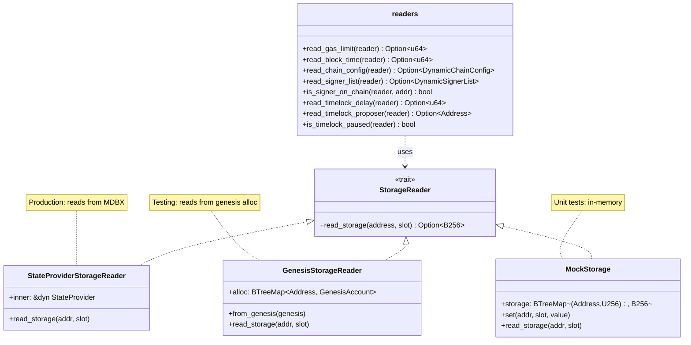

### Storage Slot Layout

**ChainConfig Contract** (`0x...C04F1600`):

| Slot | Type | Field | Example Value |
|------|------|-------|---------------|
| 0 | `address` | `governance` | Governance Safe address |
| 1 | `uint256` | `gasLimit` | 30,000,000 |
| 2 | `uint256` | `blockTime` | 2 |
| 3 | `uint256` | `maxContractSize` | 24,576 |
| 4 | `uint256` | `calldataGasPerByte` | 16 |
| 5 | `uint256` | `maxTxGas` | 30,000,000 |
| 6 | `bool` | `eagerMining` | false |

**SignerRegistry Contract** (`0x...5164EB00`):

| Slot | Type | Field |
|------|------|-------|
| 0 | `address` | `governance` |
| 1 | `uint256` | `signers.length` |
| 2 | `mapping(address => bool)` | `isSigner` |
| 3 | `uint256` | `signerThreshold` |
| `keccak256(1)` | `address` | `signers[0]` |
| `keccak256(1) + 1` | `address` | `signers[1]` |
| `keccak256(1) + N` | `address` | `signers[N]` |

### Dynamic Array Slot Computation

For Solidity dynamic arrays at slot `p`, element `i` is stored at:

```
base = keccak256(abi.encode(p))
element_slot = base + i
```

For Solidity `mapping(address => bool)` at slot `p`, key `k`:

```
slot = keccak256(abi.encode(leftPad(k, 32), p))
```

---

## 12. Engine API Integration

The Engine API is how Reth's consensus layer communicates with the execution layer. POA blocks carry 97 bytes in `extra_data`, but alloy's conversion rejects `extra_data > 32 bytes`. The `PoaEngineValidator` works around this.

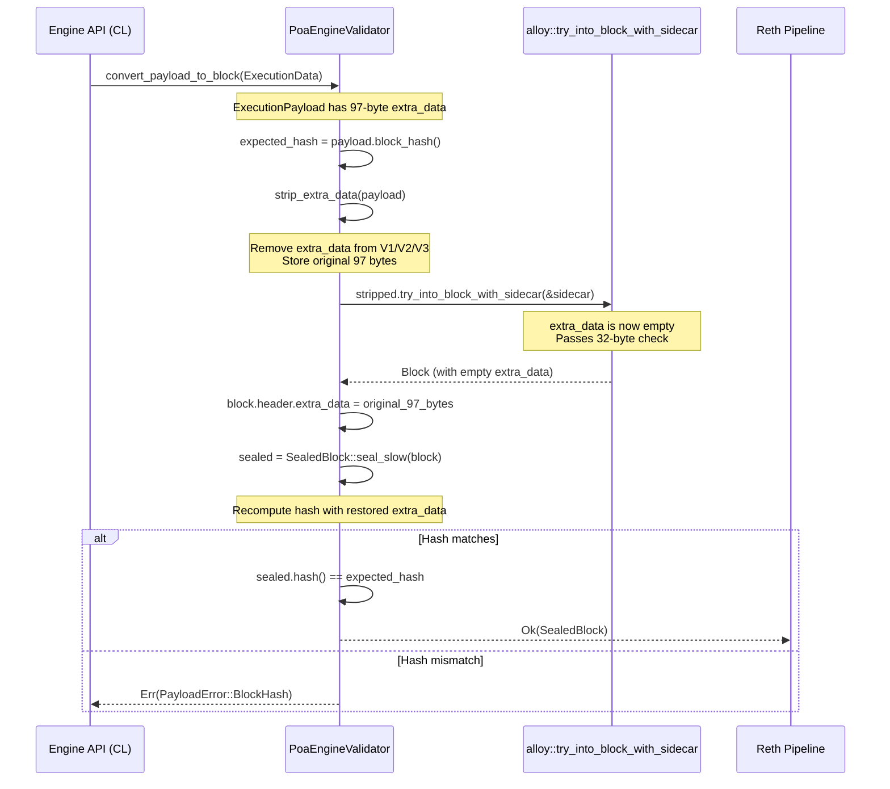

### `strip_extra_data()` Function

```rust
pub fn strip_extra_data(payload: ExecutionPayload) -> (ExecutionPayload, Bytes) {
    match payload {
        ExecutionPayload::V1(mut v1) => {
            let extra = std::mem::take(&mut v1.extra_data);  // Take ownership, leave empty
            (ExecutionPayload::V1(v1), extra)
        }
        // V2, V3 similarly (nested inner payloads)
    }
}
```

---

## 13. RPC Interface

The `rpc/` module adds a custom `meow_*` JSON-RPC namespace alongside Ethereum's standard `eth_*`, `net_*`, `web3_*` namespaces.

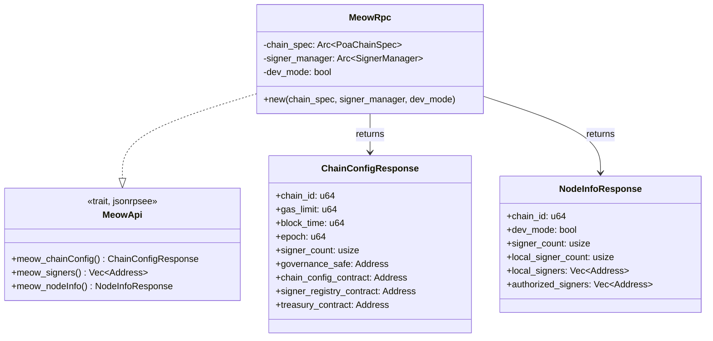

### RPC Methods

**`meow_chainConfig`** - Returns chain configuration:

```json
{
  "chainId": 9323310,
  "gasLimit": 30000000,
  "blockTime": 2,
  "epoch": 30000,
  "signerCount": 3,
  "governanceSafe": "0x000000000000000000000000000000006f5afe00",
  "chainConfigContract": "0x00000000000000000000000000000000c04f1600",
  "signerRegistryContract": "0x000000000000000000000000000000005164eb00",
  "treasuryContract": "0x0000000000000000000000000000000007ea5b00"
}
```

**`meow_signers`** - Returns authorized signer addresses:

```json
["0xf39Fd6e5...", "0x70997970...", "0x3C44CdDd..."]
```

**`meow_nodeInfo`** - Returns node status:

```json
{
  "chainId": 9323310,
  "devMode": true,
  "signerCount": 3,
  "localSignerCount": 3,
  "localSigners": ["0xf39Fd6e5...", "0x70997970...", "0x3C44CdDd..."],
  "authorizedSigners": ["0xf39Fd6e5...", "0x70997970...", "0x3C44CdDd..."]
}
```

---

## 14. Shared State & Concurrency

Multiple components share state through `Arc` wrappers and `RwLock` synchronization.

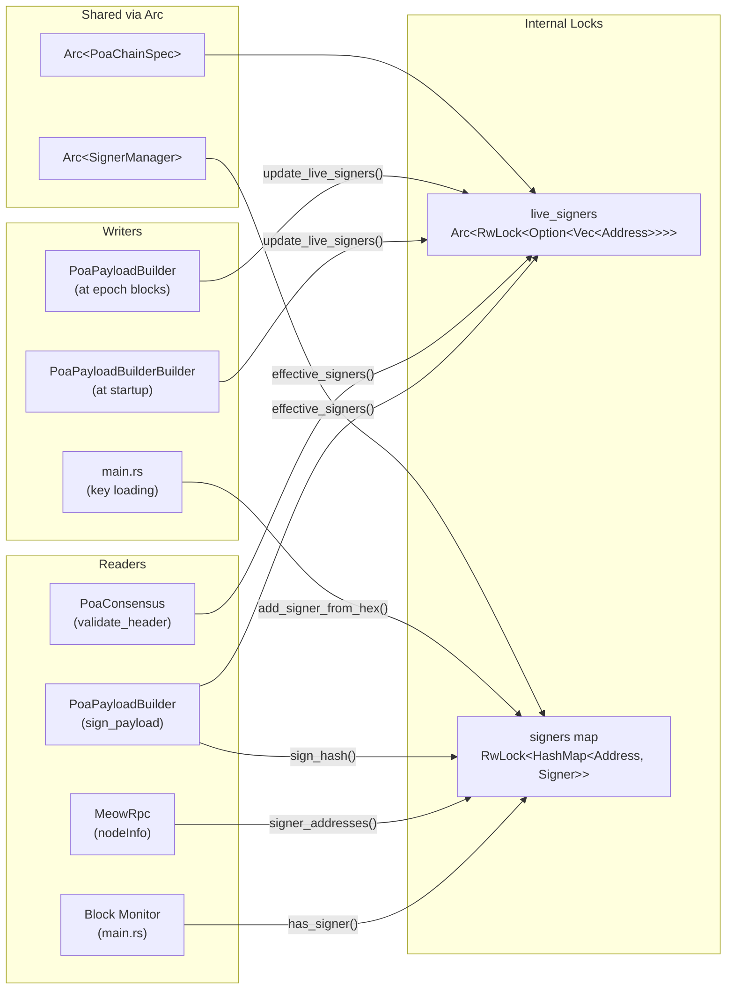

### Async-in-Sync Pattern

`PoaPayloadBuilder::sign_payload()` is called from a synchronous context (Reth's payload pipeline) but needs async signing:

```rust
// Inside sign_payload() (sync context):
let handle = tokio::runtime::Handle::current();
let result = tokio::task::block_in_place(|| {
    handle.block_on(async {
        signer_manager.has_signer(&in_turn_signer).await
    })
});
```

`block_in_place` tells tokio "this thread is about to block" so it can schedule other tasks. `block_on` then runs the async code on the current thread.

---

## 15. Console Output

The `output.rs` module (255 lines) provides 20 colored console output functions organized by context.

### Color Scheme

| Color | Usage | Example |
|-------|-------|---------|
| Blue + Bold | Section headers | `"=== Meowchain POA Node ==="` |
| Cyan | Values, addresses, numbers | `"9323310"`, `"0xf39Fd6..."` |
| Green + Bold | Success indicators | `"OK"`, `"Node started successfully!"` |
| Green | In-turn indicators | `"in-turn"`, block markers |
| Yellow + Bold | Warnings | `"WARNING:"` |
| Yellow | Out-of-turn indicators | `"out-of-turn"` |
| Dimmed | Labels, secondary info | `"Dev mode:"`, `"(no signers configured)"` |

### Functions by Category

| Category | Functions |
|----------|----------|
| Banner | `print_banner()`, `print_mode()` |
| Signers | `print_signers()`, `print_signer_loaded()`, `print_dev_signers_loaded()`, `print_no_signer_warning()` |
| Config | `print_config()` |
| RPC | `print_rpc_registered()` |
| Lifecycle | `print_node_started()`, `print_prefunded()`, `print_chain_data()`, `print_running()` |
| Consensus | `print_consensus_init()` |
| On-Chain | `print_onchain_gas_limit()`, `print_onchain_signers()` |
| Payload | `print_epoch_refresh()`, `print_block_signed()` |
| Monitor | `print_block_no_signers()`, `print_block_in_turn()`, `print_block_out_of_turn()`, `print_block_observed()` |

---

## 16. Error Handling

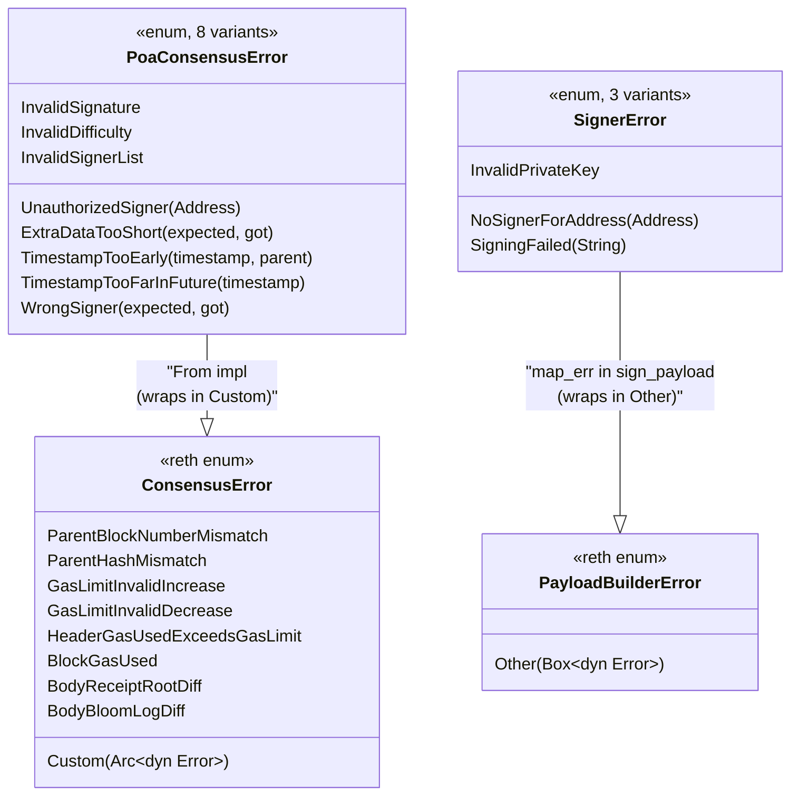

### Error Propagation

```
PoaConsensus::validate_header()
  → recover_signer() may return PoaConsensusError::ExtraDataTooShort or InvalidSignature
    → converted to ConsensusError::Custom(Arc::new(e))
  → validate_signer() may return PoaConsensusError::UnauthorizedSigner
    → converted to ConsensusError::Custom(Arc::new(e))

PoaPayloadBuilder::sign_payload()
  → BlockSealer::seal_header() may return SignerError
    → converted to PayloadBuilderError::Other(Box::new(e))
```

---

## 17. Configuration Reference

| Parameter | Dev Default | Production Default | Source | Governable |
|-----------|------------|-------------------|--------|------------|
| Chain ID | 9323310 | 9323310 | CLI `--chain-id` | No |
| Block Period | 2s | 12s | CLI `--block-time` | Yes (ChainConfig) |
| Gas Limit | 30M | 60M | CLI `--gas-limit` / ChainConfig | Yes (ChainConfig) |
| Epoch | 30,000 | 30,000 | Hardcoded | No |
| Signers | 3 | 5 | Genesis / SignerRegistry | Yes (SignerRegistry) |
| Signer Threshold | 2 | 3 | Genesis / SignerRegistry | Yes (SignerRegistry) |
| Max Contract Size | 24,576 | 24,576 | ChainConfig | Yes (ChainConfig) |
| Calldata Gas/Byte | 16 | 16 | ChainConfig | Yes (ChainConfig) |
| Max Tx Gas | 30M | 60M | ChainConfig | Yes (ChainConfig) |
| Eager Mining | false | false | CLI `--eager-mining` / ChainConfig | Yes (ChainConfig) |
| Coinbase | Miner Proxy | Miner Proxy | Genesis | No |
| Base Fee | 0.875 gwei | 0.875 gwei | Genesis | No (EIP-1559) |
| Difficulty | 0 | 0 | Hardcoded | No |
| HTTP RPC | 0.0.0.0:8545 | 0.0.0.0:8545 | CLI | No |
| WS RPC | 0.0.0.0:8546 | 0.0.0.0:8546 | CLI | No |
| P2P Port | 30303 | 30303 | CLI `--port` | No |
| Timelock Delay | 86,400s (24h) | 86,400s (24h) | Genesis / Timelock | Yes |

---

## 18. Extra Data Format

POA blocks encode authority information in the block header's `extra_data` field.

### Non-Epoch Block (97 bytes)

```
┌─────────────────────────────────┬─────────────────────────────────────────────────┐
│       Vanity (32 bytes)         │            ECDSA Signature (65 bytes)           │
│  [0x00 0x00 ... 0x00]          │  [r: 32 bytes | s: 32 bytes | v: 1 byte]       │
│  (or "Meowchain\0..." genesis) │                                                 │
├─ offset 0                      ├─ offset 32                                      │
└─────────────────────────────────┴─────────────────────────────────────────────────┘
```

### Epoch Block (97 + N*20 bytes)

```
┌──────────────────┬──────────────────────────────────────────┬──────────────────────┐
│  Vanity (32)     │       Signer List (N * 20 bytes)         │  Signature (65)      │
│  [0x00...]       │  [addr0: 20][addr1: 20]...[addrN-1: 20] │  [r | s | v]         │
├─ offset 0        ├─ offset 32                               ├─ offset 32 + N*20   │
└──────────────────┴──────────────────────────────────────────┴──────────────────────┘
```

For 3 signers: `32 + 3*20 + 65 = 157 bytes`
For 5 signers: `32 + 5*20 + 65 = 197 bytes`

### Genesis Extra Data

Same as epoch block format but with a **zero signature** (65 zero bytes) since the genesis block is not signed:

```
32 (vanity) + N*20 (signers) + 65 (zero seal) = total bytes
```

### Seal Hash Computation

The seal hash is the hash used for signing. It is the keccak256 of the RLP-encoded header with the signature portion **removed** from extra_data:

```rust
fn seal_hash(header: &Header) -> B256 {
    let mut h = header.clone();
    // Strip last 65 bytes (the signature) from extra_data
    h.extra_data = h.extra_data[..extra_data.len() - 65].to_vec().into();
    keccak256(alloy_rlp::encode(&h))
}
```

---

## 19. Testing Architecture

224 unit tests across 10 modules, organized by concern.

### Test Distribution

| Module | Tests | Key Test Patterns |
|--------|-------|-------------------|
| `consensus/mod.rs` | ~80 | Signed headers, parent validation, fork choice, 3-signer simulation, 100-block chains, signer addition/removal |
| `onchain/mod.rs` | ~55 | MockStorage, GenesisStorageReader, slot computation, governance simulation |
| `genesis/mod.rs` | ~30 | Contract presence, storage values, alloc counts, bytecode verification |
| `chainspec/mod.rs` | ~25 | Round-robin, hardforks, live signers, trait delegation |
| `signer/mod.rs` | ~20 | Sign/verify, concurrent signing, key management, dev signers |
| `payload/mod.rs` | ~12 | Epoch extra_data format, difficulty, consensus cross-verification |
| `node/mod.rs` | ~9 | Node creation, builder chain, strip_extra_data |
| `rpc/mod.rs` | ~10 | Chain config, signers, node info, JSON serialization |
| `output.rs` | 0 | (Visual output, tested by integration) |
| `main.rs` | 0 | (Entry point, tested by running) |

### Testing Patterns

**MockStorage**: In-memory `BTreeMap<(Address, U256), B256>` for testing on-chain readers without a database:

```rust
struct MockStorage {
    storage: BTreeMap<(Address, U256), B256>,
}
impl StorageReader for MockStorage {
    fn read_storage(&self, address: Address, slot: U256) -> Option<B256> {
        self.storage.get(&(address, slot)).copied()
    }
}
```

**GenesisStorageReader**: Reads from genesis alloc to verify that pre-populated contract storage matches what the readers expect:

```rust
let genesis = create_dev_genesis();
let reader = GenesisStorageReader::from_genesis(&genesis);
assert_eq!(read_gas_limit(&reader), Some(30_000_000));
```

**Dev Signers**: All signing tests use the 10 predefined dev keys. `setup_dev_signers()` loads the first 3 into a `SignerManager`:

```rust
let manager = dev::setup_dev_signers().await;
let sealer = BlockSealer::new(manager);
let signed = sealer.seal_header(header, &address).await.unwrap();
```

**Chain Segment Builder**: For sync/fork-choice tests, `build_chain_segment()` creates properly-linked chains with valid parent hashes and timestamps:

```rust
let chain = build_chain_segment(1, 100, B256::ZERO).await;
for i in 1..chain.len() {
    consensus.validate_header_against_parent(&chain[i].1, &chain[i-1].1)?;
}
```

**3-Signer Network Simulation**: Tests create 3 independent consensus instances to verify that all nodes accept the same blocks:

```rust
let nodes: Vec<PoaConsensus> = (0..3)
    .map(|_| PoaConsensus::new(chain.clone()))
    .collect();
// ALL 3 nodes must validate each block
for node in &nodes {
    HeaderValidator::validate_header(node, &sealed)?;
}
```

---

## Appendix: Key Reth Traits Implemented

| Reth Trait | Meowchain Impl | File |
|-----------|----------------|------|
| `NodeTypes` | `PoaNode` | `src/node/mod.rs:91` |
| `Node<N>` | `PoaNode` | `src/node/mod.rs:100` |
| `DebugNode<N>` | `PoaNode` | `src/node/mod.rs:152` |
| `ConsensusBuilder<N>` | `PoaConsensusBuilder` | `src/node/builder.rs:38` |
| `PayloadBuilderBuilder<N,Pool,Evm>` | `PoaPayloadBuilderBuilder` | `src/payload/builder.rs:46` |
| `PayloadBuilder` | `PoaPayloadBuilder` | `src/payload/mod.rs:56` |
| `HeaderValidator<Header>` | `PoaConsensus` | `src/consensus/mod.rs:223` |
| `Consensus<B>` | `PoaConsensus` | `src/consensus/mod.rs:316` |
| `FullConsensus<N>` | `PoaConsensus` | `src/consensus/mod.rs:363` |
| `PayloadValidator<Types>` | `PoaEngineValidator` | `src/node/engine.rs:54` |
| `EngineApiValidator<Types>` | `PoaEngineValidator` | `src/node/engine.rs:96` |
| `PayloadValidatorBuilder<Node>` | `PoaEngineValidatorBuilder` | `src/node/engine.rs:130` |
| `Hardforks` | `PoaChainSpec` | `src/chainspec/mod.rs:159` |
| `EthChainSpec` | `PoaChainSpec` | `src/chainspec/mod.rs:181` |
| `EthereumHardforks` | `PoaChainSpec` | `src/chainspec/mod.rs:233` |
| `StorageReader` | `StateProviderStorageReader` | `src/onchain/providers.rs:19` |
| `StorageReader` | `GenesisStorageReader` | `src/onchain/providers.rs:47` |
| `MeowApiServer` | `MeowRpc` | `src/rpc/mod.rs:38` |
